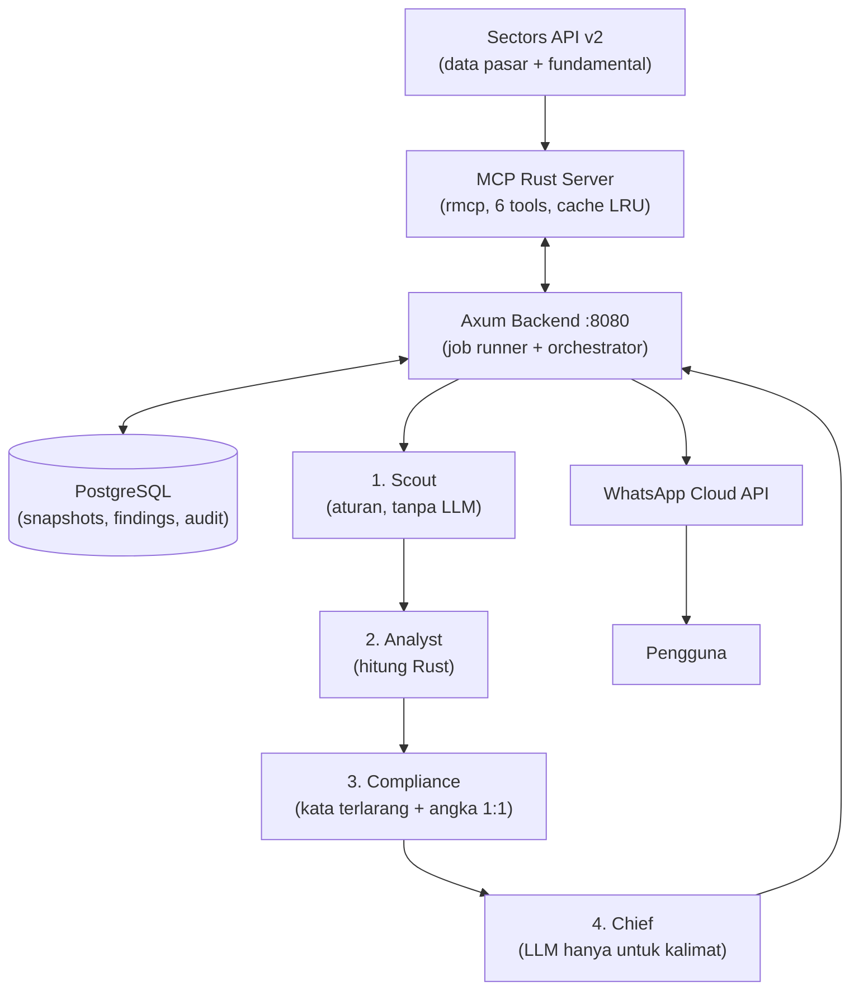

# 02 — Arsitektur

Satu diagram + alur + batasan. Untuk detail kontrak lihat `03-kontrak-data.md`, endpoint lihat `05-api-backend.md`.

## 1. Diagram alur data

Prinsip: **kode Rust menghitung angka dan menegakkan aturan; LLM hanya memahami kalimat tesis dan menulis ringkasan.** Tanpa bukti lengkap, tidak ada pesan terkirim.

## 2. Lapisan dan pemilik kode

| Lapisan | Kode | Tugas |
|---|---|---|
| Data & MCP | `src/sectors/`, `src/bin/mcp-server.rs` | HTTP client Sectors v2, cache, 6 MCP tools (stdio) |
| Backend & DB | `orchestrator/src/routes/`, `repositories/`, `migrations/` | Satu-satunya pemilik koneksi PostgreSQL. MCP tidak boleh buka pool sendiri — lewat `POST /internal/*`. |
| Agent pipeline | `orchestrator/src/orchestrator/agent_pipeline.rs`, `services/` | `run_cycle()`: watchlist → snapshot → delta → `Finding` → gate → status tesis → alert → jejak |
| Scheduler | `orchestrator/src/scheduler.rs` | Jalan berkala bila `SCHEDULER_ENABLED=true` |
| Dashboard | `dashboard/index.html` + `GET /api/*` | 1 file HTML/JS, nomor WA disamarkan di backend |

## 3. Enam MCP tools (kontrak di `src/` + gateway di `orchestrator/src/integrations/mcp_gateway.rs`)

| Tool | Fungsi |
|---|---|
| `list_subsectors` | Daftar slug subsektor (`banks`, dst) |
| `screen_companies` | Saring emiten per subsektor |
| `get_subsector_report` | Agregat subsektor (wajib param `sections` eksplisit — default 6 section = 6 kredit) |
| `get_company_evidence` | Fundamental 1 emiten (bukti audit) |
| `get_previous_snapshot` | Snapshot pembanding (didelegasikan ke `GET /internal/snapshots/previous`) |
| `record_finding` | Simpan Finding (didelegasikan ke `POST /internal/findings`) |

Error `HTTP 410` = client salah memanggil endpoint v1 yang sudah dimatikan. Client mengunci prefix `/v2/`, tidak fallback ke v1, dan mencatat `API_VERSION_DEPRECATED`.

## 4. Alur tesis → alert (ringkas)

1. User kirim tesis via WhatsApp → webhook verifikasi + dedupe `wa_message_id` → Gemini ekstrak ticker + metric (divalidasi whitelist) → status `PENDING_CONFIRMATION` → user balas `YA` → tesis aktif (maks 3 tesis/user, 3 metric/tesis).
2. Scheduler/`run_cycle()`: ambil watchlist → cek laporan baru (`since`) → simpan snapshot → butuh 2 observasi (kalau baru 1, catat baseline, jangan buat Finding palsu).
3. Hitung delta di Rust → bentuk `Finding` → 3 gate (`05-api-backend.md` §3): format → kata terlarang → evidence 1:1. Gagal = `ditolak` + alasan, tidak dikirim.
4. Hubungkan ke tesis → hitung status `MENGUAT` / `NETRAL` / `MELEMAH` → dedupe `(user, tesis, metric, period)` + cooldown + batas harian + mute `/diam` → kirim via WhatsApp → catat `agent_traces`.

## 5. Keputusan teknis yang masih mengikat

- Port **8080** (bukan 3000). Satu-satunya pemilik DB adalah Axum.
- Status tesis: `PENDING_CONFIRMATION`, `MENGUAT`, `NETRAL`, `MELEMAH`, `BELUM_CUKUP_DATA`.
- Dedupe alert: `(pengguna_id, tesis_id, metric_name, period)` + dedupe pesan masuk via `wa_message_id` unik.
- `NEUTRAL_RELATIVE_THRESHOLD=0.02` masih asumsi sementara.
- `confidence_score` pipeline saat ini 0.9 konservatif sampai tim punya model confidence.
- Tabel lama bernama Indonesia (`pengguna`, `tesis`, ...) dipertahankan agar migrasi tidak putus; konsep baru dipetakan di kode.

Histori keputusan tahap 0–8 dan konflik yang sudah selesai ada di `archive/integration-decisions.md` — baca hanya kalau butuh konteks, bukan acuan.
