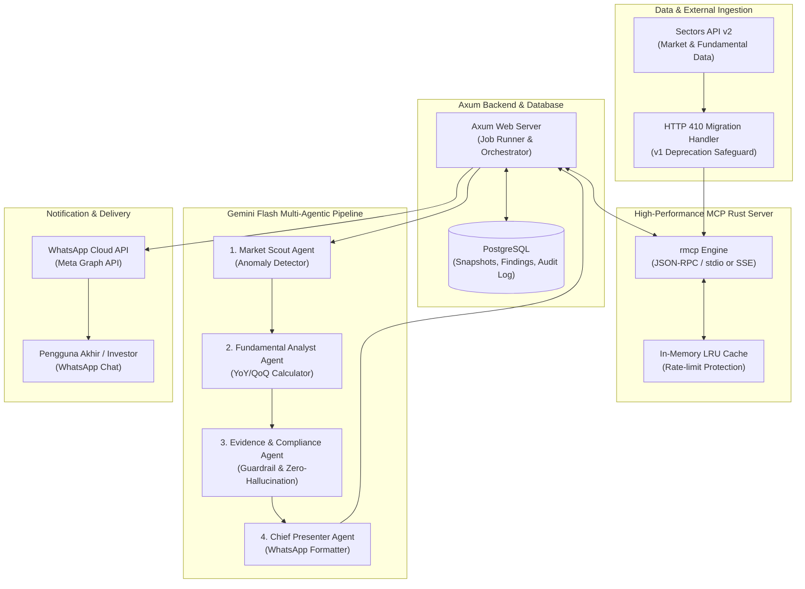

# Sistem Arsitektur & Spesifikasi MCP

Dokumen ini menjelaskan arsitektur sistem, aliran data end-to-end, penanganan endpoint Sectors API v2, serta spesifikasi antarmuka *Model Context Protocol* (MCP) Rust Server.

---

## 1. Diagram Alur Data

### Diagram Mermaid



### Diagram ASCII
```text
 +-------------------------------------------------------------------------+
 |                            Sectors API v2                               |
 |   /v2/subsectors/ | /v2/companies/ | /v2/company/report/ | /v2/subsector/|
 +-------------------------------------------------------------------------+
                                      │ (HTTPS with API Key)
                                      ▼
 +-------------------------------------------------------------------------+
 |                       MCP Rust Server (rmcp)                            |
 |  - In-memory Caching & Rate-limit Throttling                            |
 |  - HTTP 410 Handling (Explicit fallback & deprecation alert)            |
 |  - Exposes 6 Core Tools over MCP JSON-RPC                               |
 +-------------------------------------------------------------------------+
                                      ▲
                                      │ (MCP Tool Calls)
                                      ▼
 +-------------------------------------------------------------------------+
 |                           Axum Backend                                  |
 |  - Workflow Orchestration & Job Scheduler                               |
 |  - PostgreSQL Persistence (Snapshots & Findings)                        |
 +-------------------------------------------------------------------------+
                                      ▲
                                      │ (Structured JSON Prompts)
                                      ▼
 +-------------------------------------------------------------------------+
 |                    Gemini Flash Multi-Agent Pipeline                    |
 |  [Market Scout] ──► [Fundamental Analyst] ──► [Compliance] ──► [Presenter]|
 +-------------------------------------------------------------------------+
                                      │
                                      ▼ (Validated Formatted Alert)
 +-------------------------------------------------------------------------+
 |                         WhatsApp Cloud API                              |
 |              Dispatches curated notifications to users                  |
 +-------------------------------------------------------------------------+
```

---

## 2. Integrasi Sectors API v2 & Penanganan HTTP 410

### Endpoint v2 yang Digunakan
Sistem secara ketat menggunakan **Sectors API v2**. Endpoint utama yang diintegrasikan meliputi:

1. `GET /v2/subsectors/`  
   Mendapatkan daftar lengkap subsektor yang aktif di BEI beserta metrik agregat.
2. `GET /v2/companies/`  
   Menyaring emiten berdasarkan subsektor, kapitalisasi pasar, dan volume transaksi.
3. `GET /v2/company/report/{ticker}/`  
   Mengambil rincian laporan keuangan (Laba/Rugi, Neraca, Arus Kas) serta rasio fundamental historis (PER, PBV, ROE, NPM, DER).
4. `GET /v2/subsector/report/{subsector}/`  
   Mendapatkan rata-rata dan distribusi rasio industri untuk analisis deviasi saham individual.

### Penanganan HTTP 410 (Gone / Deprecated v1)
Sectors API telah menghentikan dukungan untuk v1. Setiap pemanggilan yang keliru menuju endpoint v1 akan mengembalikan status `HTTP 410 Gone`.

**Strategi Penanganan pada MCP Rust Server:**
1. **Enforce URL Path**: Rust client mengunci `BASE_URL` secara konstan ke prefix `/v2/`.
2. **Circuit Breaker & Fallback**: Jika menerima `HTTP 410`, client memicu log level `ERROR`, menolak permintaan secara fail-safe, dan meneruskan error terstruktur ke Backend:
   ```json
   {
     "error": "API_VERSION_DEPRECATED",
     "status_code": 410,
     "message": "Target endpoint version is deprecated (HTTP 410). Verify that all tool calls route to /v2/ endpoints."
   }
   ```
3. **Automated Schema Mapping**: Semua DTO (*Data Transfer Objects*) di deserialisasi menggunakan `serde` Rust yang telah disesuaikan dengan schema v2 terbaru.

---

## 3. Spesifikasi 6 Tool MCP Awal

Server MCP Rust mengimplementasikan 6 tools utama untuk konsumsi agen dan backend:

### 1. `list_subsectors`
- **Tujuan**: Mengambil daftar seluruh subsektor yang terdaftar di bursa.
- **Input Parameters**:
  ```json
  {}
  ```
- **Output**: Array daftar subsektor beserta ringkasan jumlah emiten.

### 2. `screen_companies`
- **Tujuan**: Menyaring kandidat saham berdasarkan parameter tertentu (subsektor, min market cap, min volume surge).
- **Input Parameters**:
  ```json
  {
    "subsector": { "type": "string", "description": "Nama subsektor, e.g. 'banks'" },
    "min_market_cap": { "type": "number", "description": "Nilai minimal market cap (opsional)" },
    "limit": { "type": "integer", "default": 20 }
  }
  ```
- **Output**: Daftar emiten yang memenuhi kriteria skrining.

### 3. `get_subsector_report`
- **Tujuan**: Mengambil statistik agregat dan rasio rata-rata industri untuk perbandingan anomali.
- **Input Parameters**:
  ```json
  {
    "subsector": { "type": "string", "description": "Nama subsektor resmi" }
  }
  ```
- **Output**: Metrik agregat industri (median PER, rata-rata PBV, median NPM).

### 4. `get_company_evidence`
- **Tujuan**: Mengambil data laporan fundamental emiten secara lengkap sebagai bukti audit (*evidence snapshot*).
- **Input Parameters**:
  ```json
  {
    "ticker": { "type": "string", "pattern": "^[A-Z]{4}$", "description": "Kode saham (e.g. 'BBCA')" },
    "period": { "type": "string", "description": "Periode keuangan, e.g. 'Q3 2024' (opsional)" }
  }
  ```
- **Output**: Data finansial lengkap yang dipakai sebagai basis verifikasi kebenaran angka.

### 5. `get_previous_snapshot`
- **Tujuan**: Mengambil snapshot data observasi sebelumnya yang tersimpan di PostgreSQL untuk memvalidasi perubahan nilai (*delta tracking*).
- **Input Parameters**:
  ```json
  {
    "ticker": { "type": "string" },
    "metric_name": { "type": "string" }
  }
  ```
- **Output**: Nilai observasi terakhir, timestamp observasi, dan riwayat deviasi.

### 6. `record_finding`
- **Tujuan**: Menyimpan temuan terverifikasi (`Finding`) ke dalam PostgreSQL setelah melewati validasi kepatuhan (*Compliance Checker*).
- **Input Parameters**: Objek `Finding` sesuai kontrak schema pada [docs/CONTRACTS.md](CONTRACTS.md).
- **Output**: Status penyimpanan dan `finding_id` terdaftar.
